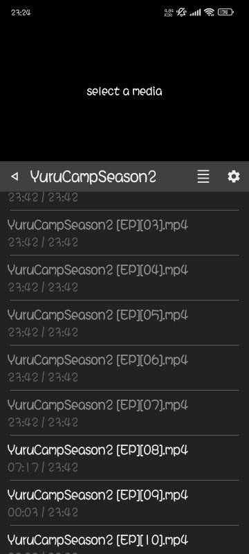
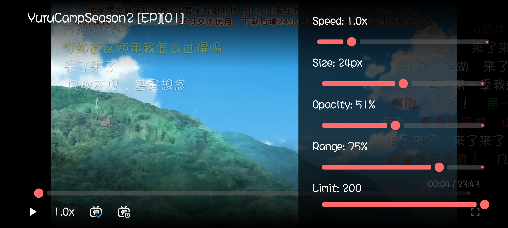

# Player

[](https://github.com/coffeecat123/app-player/releases)

## 🐈 專案介紹 (Project Overview)

**Player** 是一個現代化的 Android 媒體播放應用程式。它專為提供高品質的音訊和視訊播放體驗而設計，並內建了先進的**彈幕 (Danmu / Floating Comments)** 系統和強大的背景播放功能。

我們致力於將傳統媒體播放與社群互動體驗結合，為使用者提供一個功能豐富且高度客製化的觀看環境。

## ✨ 核心功能 (Features)

* **多媒體播放 (Media Playback):** 支援常見的視訊格式（`mp4`, `mkv`, `webm`, `m4v`, `mov`）和音訊格式（`mp3`, `m4a`, `wav`, `ogg`, `flac`, `aac`）。
* **彈幕系統 (Danmu System):** 支援互動式浮動評論，具備可客製化的設定（如速度、大小、透明度）。
* **背景播放 (Background Playback):** 應用程式在背景執行時，可繼續播放音訊內容。
* **螢幕方向處理 (Orientation Handling):** 支援自動與手動切換螢幕方向（直向/橫向）。
* **進度追蹤 (Progress Tracking):** 自動記憶每個媒體檔案的上次播放位置。
* **資料夾管理 (Folder Management):** 輕鬆添加和管理多個媒體內容資料夾。
* **客製化 UI (Customizable UI):** 調整播放速度、彈幕設定等更多個性化選項。

## 🛠️ 技術細節 (Technical Details)

| 類別 | 細節 |
| :--- | :--- |
| **主要語言** | Kotlin |
| **UI 工具包** | Jetpack Compose (現代化 UI 框架) |
| **媒體核心** | ExoPlayer (Media3) 用於高性能媒體播放 |
| **背景服務** | 實現 MediaSessionService 以支援背景播放 |
| **資料持久化** | 使用 DataStore 進行設定與播放進度持久儲存 |
| **支援版本** | Android 7.0 (API 24) 及以上 |

## 🚀 安裝與執行 (Installation)

### 系統要求

* Android 7.0 (API 24) 或更高版本。
* Android Studio (推薦使用最新穩定版本)。

### 開發者設定

1.  **複製倉庫 (Clone the repository)**
    ```bash
    git clone [https://github.com/coffeecat123/app-player.git](https://github.com/coffeecat123/app-player.git)
    ```

2.  **開啟專案**
    在 Android Studio 中開啟複製下來的專案資料夾。

3.  **建置與執行**
    等待 Gradle 同步完成後，即可在連接的 Android 裝置或模擬器上執行（`Run`）應用程式。

## 📖 使用指南 (Usage)

### 1. 添加媒體

1.  在主畫面點擊 **`+` 按鈕**。
2.  選擇一個包含您的媒體檔案的資料夾。
3.  App Player 將自動掃描並列出所有支援的媒體檔案。

### 2. 播放媒體

1.  瀏覽至指定的媒體資料夾。
2.  點擊任何媒體檔案即可開始播放。
3.  使用控制欄進行播放控制、進度調整和音量控制。

### 3. 彈幕功能

1.  在播放過程中，點擊螢幕並選擇 **彈幕圖標** 進入設定。
2.  調整彈幕的速度、大小、透明度及顯示範圍。

### 4. 設定

* 可以從主畫面或播放介面進入設定頁面。
* 客製化播放偏好和詳細彈幕設定。

## 📸 截圖展示 (Screenshots)

<table width="100%">
  <thead>
    <tr>
      <th align="center">主畫面 (Main Screen)</th>
      <th align="center">播放介面 (Playback Screen)</th>
      <th align="center">彈幕設定 (Danmu Settings)</th>
    </tr>
  </thead>
  <tbody>
    <tr>
      <td align="center">
        
      </td>
      <td align="center">
        
      </td>
      <td align="center">
        
      </td>
    </tr>
  </tbody>
</table>

## 🤝 貢獻指南 (Contributing)

我們非常歡迎任何形式的貢獻！您可以透過以下方式參與專案：

1.  **Fork** 本倉庫。
2.  建立您的功能分支 (`git checkout -b feature/amazing-feature`)。
3.  提交您的修改 (`git commit -m 'Add some amazing feature'`)。
4.  推送到您的分支 (`git push origin feature/amazing-feature`)。
5.  開啟一個 **Pull Request (PR)**。

## 📄 授權條款 (License)

本專案採用 **MIT 授權條款**。詳情請見 [LICENSE](LICENSE) 檔案。

Copyright (c) [2025] [coffeecat123]

---

## 謝誌 (Acknowledgements)

* **ExoPlayer (Media3)** - 強大且靈活的 Android 媒體播放函式庫。
* **Jetpack Compose** - 現代化、聲明式的 Android UI 工具包。
* **AndroidX Media3** - Android 媒體功能的整合函式庫。

> （註：文件部分內容可能由 AI 產生）